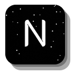

#  NightPanel Website Template
Created by [@t-a-g-o](https://github.com/t-a-g-o)

> NightPanel is a minimalistic, dark-themed UI designed for modern websites. It combines a sleek layout with organized content, providing an intuitive and visually appealing experience. Ideal for platforms that want to emphasize simplicity while maintaining functionality.
> View it live [_here_](https://ascendara.app).

## Table of Contents
* [Technologies Used](#technologies-used)
* [Features](#features)
* [Screenshots](#screenshots)
* [Setup](#setup)
* [License and Contact](#license-and-contact)

## Technologies Used


## Features
- **Dark-Themed:** Offers a clean, modern look with a focus on a dark color palette for a sleek user interface.
- **Responsive Design:** Optimized for most screen sizes, ensuring smooth performance on desktops, tablets, and mobile devices.
- **Minimalist Layout:** Prioritizes content with a simple, easy-to-navigate structure that avoids clutter.
- **Customizable Elements:** Easily modify colors, fonts, and layout settings to match your branding or preferences.
- **Features Bento Grid:** Customize 7 different features to display
- **Testimonials Marquee:** Show off as many testimonials as you want as they scroll by the screen

## Screenshots


## Setup
1. Clone the repository
    ```sh
    git clone https://github.com/t-a-g-o/nightpanel.git
    ```

2. Go into the NightPanel directory
    ```sh
    cd nightpanel
    ```

3. Install requirements
    ```sh
    npm install -r
    ```

4. Run the live dev preview
    ```sh
    npm run dev
    ```
To make a favicon show in the browser, add an icon image to `src/app/`. It has to be "ico" format and it has to be named "favicon.ico".  Make the icon 256x256 if possible, this is the most visible and detailed icon in the browser.

## License and Contact
This project is published under the [MIT License](./LICENSE)

If you are interested in working together, or want to get in contact with me please email me at santiago@tago.works
